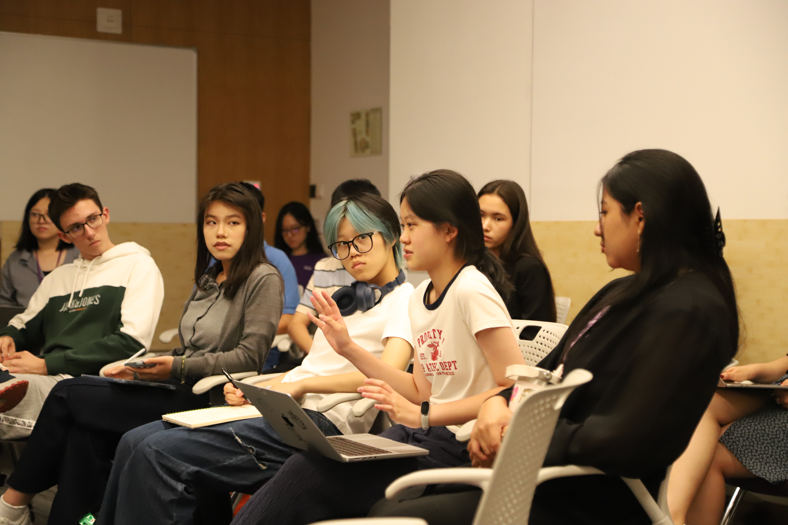
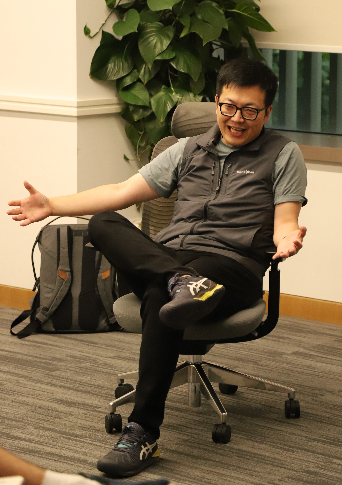
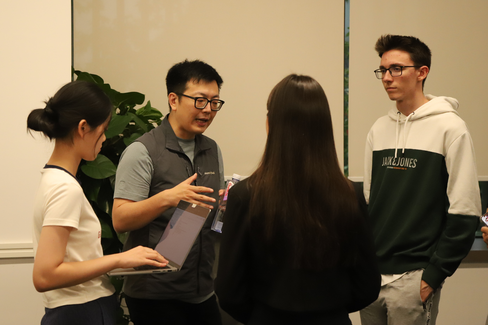

# 序 Preface

从今天起，**Digital Innovation Challenge 2025** 正式进入预热阶段。我们将与 NYU Shanghai 教授合作，并邀请 AI 领域的嘉宾，共同推出一系列预热工作坊，带大家了解 AI 技术的发展趋势及其商业价值。  

Starting today, **Digital Innovation Challenge 2025** enters its warm-up stage. Together with professors from NYU Shanghai and guest experts in AI, we will host a series of Warm-up Workshops to explore the latest developments in AI and uncover its business value.  

---
# 2025-09-17 · Warm-up Workshop with Du Lei

---

## 主讲人介绍 Introduction of the Guest Speaker

**杜磊**，现任 Sancus Ventures 合伙人，专注于投资人工智能及软件基础设施领域的创业者。此前，他作为创始团队成员兼首席科学家加入 Opendoor，助力公司实现规模化并成功上市，随后共同创立 Huma Finance。  

他因擅长招募和培养顶尖工程师而备受认可，其中不少人才如今已在 OpenAI 与 Anthropic 担任核心职位。同时，他积极扶持新一代创业者，其指导的多家初创企业已进入 Y Combinator、HF0 等全球知名加速器，展现了他在推动创新与培育人才方面的持续影响力。  

Du Lei is a Partner at Sancus Ventures, investing in ambitious founders across AI and software infrastructure. Previously, he was a founding team member and Chief Scientist at Opendoor, helping scale the company to its IPO, and later co-founded Huma Finance. Known for recruiting and mentoring top engineers now leading at OpenAI and Anthropic, he actively supports the next generation of builders. Several of the startups he has guided have been admitted into world-class accelerators such as Y Combinator and HF0, reflecting his deep commitment to fostering entrepreneurial talent.

---

## 活动回顾 Event Review

本次工作坊吸引了 **20 多位学生** 前来参与，与投资人杜磊展开了一场真诚而热烈的交流。  

在分享中，杜磊结合自己的求学、职业和投资经历，展示了一位资深创业者与投资人的成长路径，并为新一代创业者带来鼓励与启发。  

More than twenty students joined the workshop and took part in an open and lively conversation with investor Du Lei, exchanging ideas and experiences. He drew on his academic, professional, and investment experiences to present the growth journey of a seasoned entrepreneur and investor, while inspiring the next generation of founders.  

---

## 创业启示 Key Takeaways

### 创业门槛降低 Opportunities of Our Time
云计算、开源工具和 AI 自动化让小团队甚至个人都能快速打造产品，学生可直接将学习成果转化为实践。  

Cloud computing, open-source tools, and AI automation are lowering barriers to entrepreneurship, enabling even students to turn ideas into real products.  

---

### 快速迭代 Action over Perfection
先做出 Demo，再不断优化；不要等待完美条件，而要用最小可行产品验证市场。  

Start with a demo, test the market early, and improve through iteration instead of waiting for perfection.  

---

### 团队与人脉 Power of Teams
大学里的黑客松、社团与合作项目，可能就是未来创业伙伴的起点。  

University hackathons, clubs, and projects can be the birthplace of future co-founders and partners.  

---

### 资源利用 Using Resources Wisely
Y Combinator 等加速器可提供导师、资金和人脉，学生应积极争取。  

Platforms like Y Combinator provide funding, mentorship, and networks to help startups grow faster.  

---

### 勇气与行动 Courage to Begin
不要因年轻或缺乏经验而怀疑自己，许多伟大公司都诞生于学生或年轻人勇敢的第一步。  

Age and inexperience are not obstacles—many iconic companies were started by students who dared to take the first step.  

---

杜磊强调，如今的技术与创业环境为小团队甚至个人提供了前所未有的机遇。只要拥有过硬的产品能力、创新的迭代思路和持续的执行力，就有可能在不久的将来打造出独角兽公司。他鼓励同学们勇于尝试，把握时代机遇。  

He stressed that today’s tech and startup environment offers unprecedented opportunities for small teams and individuals, encouraging students to seize the moment.  

这场讲座为大学生勾勒出了一条清晰路径：在校园中积累技能和人脉，勇敢尝试创业项目，并通过迭代和外部资源逐步走向成功——让“从校园到创业”的想象真正成为可能。  

The lecture presented a clear path for students: build skills and networks on campus, try entrepreneurship with courage, and progress through iteration and external support — making the journey from campus to entrepreneurship truly attainable.  

